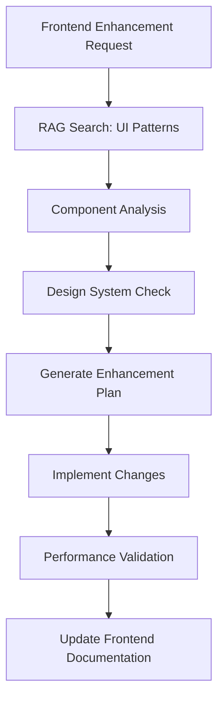
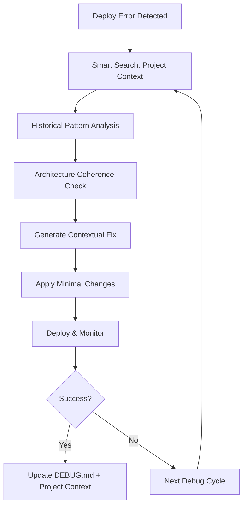

# 🧠 Agents Smart Systems Configuration - SCRIBE

## Configuration des systèmes intelligents pour KodaF (RAG) et Dako (Smart Search)

---

## 🎨 KodaF - Frontend Specialist RAG

### 📊 Sources de Connaissance
```yaml
primary_sources:
  - "FRONTEND_ENHANCEMENT_AGENT.md"      # Mission briefing complete
  - "FRONTEND_DEBUG.md"                  # Debug methodology + succès KodaF
  - "frontend/components/ui/*.tsx"       # Component patterns shadcn/ui
  - "frontend/app/**/*.tsx"              # Page structure et patterns
  - "package.json"                       # Dependencies frontend
  - "next.config.js"                     # Next.js configuration
  - "tailwind.config.js"                 # Design system configuration

secondary_sources:
  - "CLAUDE.md"                          # Architecture overview
  - Modern frontend best practices       # Web search integration
  - shadcn/ui documentation             # Component library patterns
  - Next.js 14 documentation           # Framework best practices
  - CVA (class-variance-authority)      # Component variant patterns
```

### 🔍 Recherche Spécialisée KodaF
```python
# Patterns de recherche frontend
SEARCH_PATTERNS = {
    "component_enhancement": {
        "query": "shadcn/ui component + CVA variants + TypeScript",
        "sources": ["ui_components", "design_system"],
        "weight": 0.9
    },
    "animation_patterns": {
        "query": "framer-motion + micro-interactions + UX",
        "sources": ["frontend_docs", "web_search"],
        "weight": 0.8
    },
    "performance_optimization": {
        "query": "Next.js optimization + lazy loading + bundle",
        "sources": ["next_docs", "performance_guides"],
        "weight": 0.85
    },
    "mobile_responsiveness": {
        "query": "mobile-first + responsive + touch UX",
        "sources": ["ui_patterns", "accessibility_guides"],
        "weight": 0.8
    }
}
```

### 🎯 KodaF RAG Capabilities
- **Component Pattern Recognition** - Identifier les patterns UI optimaux
- **Design System Evolution** - Évolution cohérente du design system
- **Performance Optimization** - Bundle size, lazy loading, optimisations
- **Accessibility Enhancement** - ARIA, keyboard navigation, screen readers
- **Mobile-First Optimization** - Touch interfaces, responsive patterns

---

## 🛠️ Dako - Debug Specialist Smart Search

### 📊 Sources de Connaissance (Fichiers Info Projet)
```yaml
primary_sources:
  - "CLAUDE.md"                          # Architecture complète + historique projet
  - "DEBUG.md"                           # Historique complet 13 issues résolues
  - "FRONTEND_DEBUG.md"                  # Méthodologie debug + succès KodaF
  - "ARCHITECTURE_REVIEW.md"             # Review architecture 95% alignment
  - "FRONTEND_ENHANCEMENT_AGENT.md"      # Context agents existants
  - "package.json"                       # Dependencies frontend/backend
  - "render.yaml"                        # Configuration deployment

project_context:
  - Historique debug complet            # Patterns résolus précédemment
  - Architecture decisions              # Choix techniques documentés
  - Agent coordination                  # Context multi-agents
  - Deployment methodology              # Approche systématique éprouvée
  - Success patterns                    # Solutions qui ont fonctionné

smart_search_focus:
  - Context global du projet            # Image d'ensemble pour décisions intelligentes
  - Historique debug similaire         # Réutilisation patterns réussis
  - Cohérence architecturale           # Solutions alignées avec l'existant
  - Méthodologie éprouvée              # Approche systématique validée
```

### 🔍 Smart Search Spécialisé Dako
```python
# Patterns de recherche contextuelle projet
SMART_SEARCH_PATTERNS = {
    "error_context_analysis": {
        "query": "similar error + DEBUG.md + solution pattern",
        "sources": ["project_files", "debug_history"],
        "weight": 0.95
    },
    "architecture_alignment": {
        "query": "solution + architecture + CLAUDE.md context",
        "sources": ["architecture_docs", "project_context"],
        "weight": 0.9
    },
    "methodology_consistency": {
        "query": "debug approach + systematic method + proven pattern",
        "sources": ["debug_methodology", "success_history"],
        "weight": 0.85
    },
    "project_coherence": {
        "query": "solution + global context + agent coordination",
        "sources": ["project_overview", "agent_context"],
        "weight": 0.9
    },
    "deployment_intelligence": {
        "query": "render deployment + project history + best practices",
        "sources": ["deployment_context", "platform_knowledge"],
        "weight": 0.88
    }
}
```

### 🎯 Dako Smart Search Capabilities
- **Project Context Awareness** - Compréhension globale du projet SCRIBE
- **Historical Pattern Reuse** - Réutilisation intelligente des solutions DEBUG.md
- **Architecture Coherence** - Solutions alignées avec l'architecture existante
- **Methodology Consistency** - Approche systématique éprouvée
- **Multi-Agent Coordination** - Context des autres agents (KodaF, Leo, etc.)

---

## 🔄 RAG Integration Workflow

### KodaF Enhancement Process


### Dako Debug Process


---

## 🧮 RAG Technical Configuration

### Embedding Configuration
```python
# Configuration commune
EMBEDDING_CONFIG = {
    "model": "text-embedding-3-large",
    "dimensions": 1536,
    "similarity_threshold": 0.8,
    "max_context_length": 4000,
    "chunk_size": 1000,
    "chunk_overlap": 200
}

# KodaF spécifique
KODAF_CONFIG = {
    "focus_domains": ["ui", "ux", "performance", "accessibility"],
    "pattern_weight": 0.9,
    "performance_priority": True,
    "mobile_first": True
}

# Dako spécifique
DAKO_CONFIG = {
    "focus_domains": ["debug", "deployment", "project_context", "methodology"],
    "context_awareness_weight": 0.95,
    "historical_priority": True,
    "project_coherence": True
}
```

### Vector Store Structure
```python
# KodaF Vector Store
kodaf_store = {
    "ui_components": ComponentPatternVectors,
    "design_system": DesignTokenVectors,
    "performance": OptimizationVectors,
    "accessibility": A11yPatternVectors,
    "mobile_ux": ResponsiveVectors
}

# Dako Smart Search Store
dako_store = {
    "project_context": ProjectContextVectors,
    "debug_history": DebugHistoryVectors,
    "architecture_knowledge": ArchitectureVectors,
    "methodology_patterns": MethodologyVectors,
    "agent_coordination": AgentContextVectors
}
```

---

## 📊 Performance Monitoring

### KodaF Metrics
- **Enhancement Quality Score** - Before/after component comparison
- **Performance Impact** - Bundle size, loading times
- **User Experience Score** - Accessibility, mobile usability
- **Code Quality** - TypeScript strict compliance, best practices

### Dako Metrics
- **Context Accuracy** - Qualité de compréhension du projet
- **Solution Coherence** - Alignement avec l'architecture existante
- **Historical Reuse** - Réutilisation efficace des patterns éprouvés
- **Project Intelligence** - Décisions intelligentes basées sur le contexte global

---

## 🚀 Deployment Strategy

### Agent Launch Commands
```bash
# KodaF Frontend Enhancement
task_kodaf = Task(
    description="Frontend enhancement with RAG",
    prompt="Load KodaF RAG + FRONTEND_ENHANCEMENT_AGENT.md",
    subagent_type="kodaf-specialist"
)

# Dako Debug Automation
task_dako = Task(
    description="Debug automation with Smart Search",
    prompt="Load Dako Smart Search + DEBUG.md + project context + debug_auto tool",
    subagent_type="dako-specialist"
)
```

### Smart System Update Triggers
- **KodaF**: Nouveau component créé, enhancement completé
- **Dako**: Nouvel issue résolu, nouveau context projet découvert
- **Both**: Major architecture changes, new methodologies

---

## 🎯 Success Criteria

### KodaF Success Metrics
- **UI Enhancement Quality** - Professional-grade components
- **Performance Improvement** - Lighthouse scores 95+
- **Code Consistency** - Design system adherence
- **Development Velocity** - Faster component iteration

### Dako Success Metrics
- **Context Intelligence** - 95%+ accurate project understanding
- **Debug Efficiency** - <3 cycles average per issue
- **Solution Coherence** - Decisions aligned with project architecture
- **Methodology Consistency** - Systematic approach maintained

---

**Integration Status:** Ready for immediate deployment
**Smart Systems:** KodaF RAG + Dako Smart Search optimisés
**Cross-Agent Intelligence:** Context partagé et coordination

*Agents KodaF et Dako prêts avec systèmes intelligents optimisés! 🧠🚀*